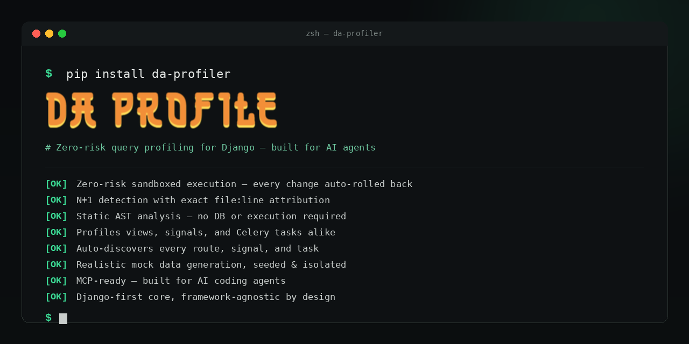

<p align="center">
  
</p>

[](https://pypi.org/project/da-profiler/)
[](https://www.python.org/)
[](https://www.djangoproject.com/)
[](LICENSE)
[](https://github.com/astral-sh/ruff)



> **The Agentic ORM Profiler & Performance Orchestrator for Django.**

`Da Profiler` (package `dqs`) discovers your Django project's endpoints automatically, executes them safely in isolated, self-rolling-back transaction savepoints, intercepts queries at the DB-driver boundary, and detects N+1 queries using AST-based SQL fingerprinting — then hands the result to an AI coding agent (or a human) as a prescriptive, copy-pasteable ORM fix.

---

## ⚡ Quick Navigation

- [Key Features](#-key-features)
- [Why Da Profiler?](#-why-da-profiler)
- [Feature Comparison](#-feature-comparison)
- [Architecture & Design](#-architecture--design)
- [How It Works](#-how-it-works)
- [Dynamic Route & Mock Data Engine](#-dynamic-route--mock-data-engine)
- [AI Agent Integration (MCP)](#-ai-agent-integration-mcp)
- [Installation & Quickstart](#-installation--quickstart)
- [Running Tests](#-running-tests)
- [Project Documentation](#-project-documentation)
- [Contributing & License](#-contributing--license)

---

## ✨ Key Features

- 🛡️ **Zero-Trace Transaction Sandbox**: Runs profile targets inside `transaction.atomic()` savepoints, automatically rolling back mutations post-execution. Real DB state is never modified.
- 🧬 **AST-Based SQL Fingerprinting**: Powered by `sqlglot`. Strips numeric/string literals, normalizes dynamic `IN (...)` parameter lists, and canonicalizes table aliases to eliminate false positives.
- 🎯 **Target Discovery Engine**: Auto-discovers Django views (FBV, CBV, DRF ViewSets), signal receivers (`post_save`, `pre_save`, etc.), Celery tasks, and Channels ASGI consumers.
- 🔮 **Dynamic Parameter & Payload Resolution**: Resolves parameterized routes (`/books/<int:pk>/`) and automatically infers DRF serializer mock payloads for `POST`, `PUT`, and `PATCH` requests.
- 💡 **Prescriptive Fix Suggestions**: Pinpoints N+1 origins to precise user code lines and outputs exact `.select_related()` or `.prefetch_related()` remediation logic.
- 🤖 **Agent-First (MCP Ready)**: Exposes tool hooks (`list_django_routes`, `profile_endpoint`, `seed_mock_data`) for Cursor, Claude Code, and Windsurf to profile, fix, and verify performance headlessly.
- 🧱 **Decoupled Engine Design**: Strict separation between framework-agnostic analysis (`dqs/core/`) and Django/DRF adapters (`dqs/adapters/drf/`).

---

## 💡 Why Da Profiler?

Traditional profilers (e.g. Django Debug Toolbar, Django Silk) are **reactive and human-dependent**:
1. You must manually click around a web browser to populate query logs.
2. Logged queries pollute development database tables or log outputs.
3. You get raw SQL outputs rather than structured, actionable ORM fixes.

`Da Profiler` flips this workflow:
- **Proactive & Headless**: Scans URL pattern trees without manual browsing.
- **Zero-Footprint DB Execution**: Transactions roll back immediately.
- **Prescriptive ORM Remediation**: Converts raw AST query structures into exact Django queryset code fixes.
- **Agentic Loop**: Designed for automated dev agents to inspect, refactor, and re-verify performance fixes end-to-end.

---

## 📊 Feature Comparison

| Feature | Django Debug Toolbar | Django Silk | Da Profiler (`dqs`) |
|---|---|---|---|
| **Discovery** | Manual page rendering | Passive traffic logging | **Active URL & signal discovery tree** |
| **DB Footprint** | None | High (persists log rows to DB) | **Zero (100% savepoint rollback)** |
| **N+1 Detection** | Visual inspect per request | Manual SQL review | **Automated AST fingerprinting (`sqlglot`)** |
| **Fix Generation** | None | None | **Prescriptive ORM (`.select_related()`)** |
| **Param Resolution**| Manual input | Manual traffic | **Automatic mock seeding & URL reversal** |
| **CI / AI Workflow**| Not supported | Not supported | **Native MCP server for AI IDE agents** |

---

## 🏗️ Architecture & Design

Da Profiler enforces a clean architectural separation:

```
dqs/
├── core/                      # Pure Python engine — zero Django dependencies
│   ├── analyzer.py            # AST SQL fingerprinting & N+1 detection
│   ├── static_advisor.py      # Pure AST code scanner (loops & blocking I/O)
│   └── targets.py             # Framework-agnostic Target model
└── adapters/
    └── drf/                   # Django & DRF integration adapter
        ├── apps.py            # Django AppConfig (DEBUG guard)
        ├── router.py          # Shadow DB router & profiling_session
        ├── types.py           # Shared dataclasses
        ├── views.py           # Dashboard & AJAX endpoints
        ├── urls.py            # URL config (/dqs/, /dqs/profile/)
        ├── database/
        │   └── db_manager.py  # Shadow DB validation & migrations
        ├── routing/
        │   ├── introspector.py    # URL route pattern tree walker
        │   └── converters.py      # Dynamic path parameter resolver
        ├── mocking/
        │   └── generator.py       # Model Bakery wrapper & body inference
        └── execution/
            ├── discovery.py       # Target discovery (views, signals, tasks)
            ├── query_interceptor.py # DB execute_wrapper hook
            ├── runner.py          # Savepoint execution engine
            └── schema_advisor.py  # Schema & PK strategy recommendations
```

> 📖 For full system diagrams and execution sequence specifications, check out [`ARCHITECTURE.md`](./ARCHITECTURE.md).

---

## 🔍 How It Works

### Step-by-Step N+1 Identification

#### 1. Unoptimized View Code
```python
# sample_app/views.py
from django.http import JsonResponse
from .models import Book

def list_books(request):
    books = Book.objects.all()  # Initial query
    data = [
        {"title": book.title, "author": book.author.name}  # N+1 queries in loop
        for book in books
    ]
    return JsonResponse(data, safe=False)
```

#### 2. Captured SQL Execution
```sql
SELECT "id", "title", "author_id" FROM "sample_app_book";
SELECT "id", "name" FROM "sample_app_author" WHERE "id" = 10;
SELECT "id", "name" FROM "sample_app_author" WHERE "id" = 25;
SELECT "id", "name" FROM "sample_app_author" WHERE "id" = 42;
```

#### 3. AST Normalization (`dqs.core.analyzer`)
Queries parse into AST representations and collapse to a single fingerprint:
```sql
SELECT "id", "name" FROM "sample_app_author" WHERE "id" = ?
```

#### 4. Prescriptive Report Output
```json
{
  "fingerprint": "SELECT \"id\", \"name\" FROM \"sample_app_author\" WHERE \"id\" = ?",
  "count": 3,
  "source_location": "sample_app/views.py:7",
  "suggestion": "Add .select_related('author') to your QuerySet."
}
```

---

## 🛠️ Dynamic Route & Mock Data Engine

For routes like `/books/<int:pk>/` or `/authors/<uuid:id>/`:

```
1. Introspect Path Converters  ---> 2. Resolve Model & Seed Mock  ---> 3. Reverse Executable URL
   (int, uuid, slug, str, path)     (via model_bakery & cache)           (/books/42/)
```

`POST` / `PUT` request bodies are dynamically built by `dqs.adapters.drf.mocking.generator.infer_request_body` by inspecting DRF serializers (`serializer_class`) or Django forms.

---

## 🤖 AI Agent Integration (MCP)

Da Profiler provides a Model Context Protocol (MCP) server for Cursor, Windsurf, and Claude Code:

```
+------------------+         list_django_routes()         +------------------+
|                  | -----------------------------------> |                  |
|   AI IDE Agent   |        profile_endpoint(target)      |   Da Profiler    |
| (Cursor / Claude)| -----------------------------------> |    MCP Server    |
|                  | <----------------------------------- |                  |
+------------------+     Enriched Findings & ORM Fix      +------------------+
```

---

## 🚀 Installation & Quickstart

### Installation

```bash
pip install da-profiler[django]
```

Add `dqs.adapters.drf` to your `INSTALLED_APPS` (development environment only):

```python
# settings.py
if DEBUG:
    INSTALLED_APPS += ["dqs.adapters.drf"]
    DATABASE_ROUTERS = ["dqs.adapters.drf.router.DQSRouter"]
```

### ⚙️ Shadow Database Setup & Telemetry Isolation

To isolate your default database from testing telemetry, configure a `'dqs_shadow'` entry in your `settings.DATABASES` matching your backend engine:

```python
# settings.py
DATABASES = {
    "default": {
        "ENGINE": "django.db.backends.postgresql",
        "NAME": "my_db",
        "USER": "db_user",
        "PASSWORD": "db_password",
        "HOST": "localhost",
        "PORT": "5432",
    },
    "dqs_shadow": {
        "ENGINE": "django.db.backends.postgresql",
        "NAME": "my_db_shadow",
        "USER": "db_user",
        "PASSWORD": "db_password",
        "HOST": "localhost",
        "PORT": "5432",
    },
}
```

To initialize or update your shadow database schema, execute migrations against the `dqs_shadow` database:

```bash
python manage.py migrate --database=dqs_shadow
```

#### Safe Execution Context (`profiling_session`)

Wrap any custom execution or seeding block in the `profiling_session()` context manager to route queries to `dqs_shadow`:

```python
from dqs.adapters.drf.router import profiling_session
from dqs.adapters.drf.mocking.generator import ModelBakeryGenerator

with profiling_session():
    # 1. Capped seeding (seeds up to 50 records if count < 1)
    ModelBakeryGenerator.ensure_capped_seeding("sample_app.Book", min_threshold=1, max_cap=50)
    
    # 2. View execution or ORM queries hit 'dqs_shadow'
```

---

### Development Setup (Docker)

```bash
# 1. Clone repository
git clone https://github.com/Profysr/query-profiler.git
cd query-profiler

# 2. Configure environment
cp .env.example .env

# 3. Build containers and start Postgres
docker compose build
docker compose up -d db

# 4. Start stack and run migrations
docker compose up -d
docker compose exec web python manage.py migrate
```

---

## 🧪 Running Tests

Da Profiler uses **pytest** with a marker-based test architecture.

### Test Architecture

```
tests/
├── conftest.py                      # Root: marker registration
├── core/                            # Marker: `core` — pure Python, no DB
│   ├── conftest.py                  # Auto-marks all tests as `core`
│   ├── test_analyzer.py             # SQL AST fingerprinting & N+1 detection
│   └── test_static_advisor.py       # Python AST static code scanning
└── adapters/
    └── drf/                         # Marker: `django` + `drf` — requires DB
        ├── conftest.py              # Shared fixtures: runner, introspector, seeded_book
        ├── test_body_inferrer.py    # Request body inference tests
        ├── test_converters.py       # PathConverterResolver unit tests
        ├── test_discovery.py        # Signal & task discovery tests
        ├── test_introspector.py     # URL route scanning and lookup map tests
        ├── test_query_interceptor.py# DB execute_wrapper SQL capture tests
        ├── test_runner.py           # SandboxRunner & step-driven pipeline tests
        └── test_runner_integration.py # Setup isolation & savepoint rollback test
```

### Marker Taxonomy

| Marker | Meaning | Requires DB? | Speed |
|---|---|---|---|
| `core` | Pure Python (`dqs/core/`) — no Django, no ORM | No | ⚡ Fastest |
| `django` | Django ORM + DB access (`dqs/adapters/drf/`) | Yes | 🐢 Slower |
| `drf` | DRF adapter subset of django tests | Yes | 🐢 Slower |

### Running the Test Commands

#### Option 1: From Source Repository (Recommended)

```bash
# 1. Install package in editable mode with dev dependencies
pip install -e ".[dev]"

# 2. Go to demo project for Django tests
cd demos/drf

# 3. Run migrations on shadow database
python manage.py migrate --database=dqs_shadow

# 4. Run tests
pytest -m core        # Pure Python tests (fastest — no DB, no Django setup)
pytest -m django      # Django/DRF adapter tests
pytest -v             # All tests with verbose output
```

#### Option 2: Docker Compose (Full Stack)

```bash
# From repository root
docker compose build
docker compose up -d db
docker compose up -d

# Run tests inside container
docker compose exec web pytest -m core
docker compose exec web pytest -m django
```

#### Option 3: Install Built Package in Demo Project

```bash
# 1. Build the package
pip install build
python -m build

# 2. Install in demo project
cd demos/drf
pip install ../../dist/da_profiler-0.3.0-py3-none-any.whl[django]

# 3. Run migrations and tests
python manage.py migrate --database=dqs_shadow
pytest -m core
pytest -m django
```

---

## 📚 Project Documentation

- 📄 [`ARCHITECTURE.md`](./ARCHITECTURE.md) — System design, sequence flows, and component breakdown.
- 📋 [`CHANGELOG.md`](./CHANGELOG.md) — Detailed version history, releases, and architectural decisions.
- 🗺️ [`ROADMAP.md`](./ROADMAP.md) — Development milestones, planned adapters, and feature timelines.
- 🤝 [`CONTRIBUTING.md`](./CONTRIBUTING.md) — Contribution guidelines, dev setup, and commit standards.
- 🔒 [`SECURITY.md`](./SECURITY.md) — Security policy and vulnerability reporting.
- 📜 [`CODE_OF_CONDUCT.md`](./CODE_OF_CONDUCT.md) — Community guidelines.
- 🚀 [`docs/quickstart.md`](./docs/quickstart.md) — 5-minute getting started guide.
- 💡 [`docs/how-it-works.md`](./docs/how-it-works.md) — ELI5 explanations of core concepts.
- 🧪 [`docs/how-to-test.md`](./docs/how-to-test.md) — Integration, profiling & testing guide.
- 🛠️ [`docs/developer-onboarding.md`](./docs/developer-onboarding.md) — File-by-file codebase reference.

---

## 📄 Contributing & License

Contributions are welcome! Please review [`CONTRIBUTING.md`](./CONTRIBUTING.md) before opening a pull request.

Distributed under the **MIT License**. See [`LICENSE`](./LICENSE) for details.