# Da Profiler — Architecture & System Design 🏗️

> **Da Profiler** (package `dqs`) is an isolated query profiling engine and static code advisor for Django applications. It automatically discovers endpoints, executes them safely inside self-rolling-back database savepoints, intercepts queries at the DB-driver boundary, normalizes SQL queries using AST fingerprinting to detect N+1 bottlenecks, and performs static code analysis on user code.

---

## 1. Core Architectural Principles

Da Profiler is built around three fundamental design principles:

1. **Framework-Agnostic Core (`dqs/core/`)**:
   - The core engine contains **zero Django or framework-specific imports**.
   - Handles SQL AST fingerprinting (`sqlglot`), N+1 aggregation algorithms, target abstractions (`Target`), and framework-independent static AST code scanning (`StaticASTAdvisor`).

2. **Framework Adapters (`dqs/adapters/`)**:
   - Framework-specific integration logic lives strictly inside adapters (e.g. `dqs/adapters/drf/`).
   - Adapters handle route discovery, ORM query interception, dynamic parameter resolution, synthetic mock data generation, body inference, and safe isolated execution.

3. **Zero Database Risk (Isolated Savepoints)**:
   - Profiled endpoints run strictly within `transaction.atomic()` savepoints.
   - All state changes (create, update, delete) are automatically rolled back when profiling finishes. The real database is never modified.

---

## 2. System Component Overview

```
                       +---------------------------------------+
                       |         Developer / AI Agent          |
                       +-------------------+-------------------+
                                           |
                                           v
+-----------------------------------------------------------------------------------+
|                            Da Profiler Core (dqs/core/)                           |
|                                                                                   |
|  +---------------------+   +--------------------------+   +--------------------+  |
|  |     Target Model    |   |     Static AST Advisor   |   |   AST Analyzer     |  |
|  |     (targets.py)    |   |   (static_advisor.py)    |   |   (analyzer.py)    |  |
|  +----------+----------+   +------------+-------------+   +---------+----------+  |
+-------------|---------------------------|---------------------------|-------------+
              |                           |                           |
              v                           v                           v
+-----------------------------------------------------------------------------------+
|                          Django Adapter (dqs/adapters/drf/)                       |
|                                                                                   |
|  +--------------------+    +---------------------------+    +------------------+  |
|  |  Target Discovery  |    |    DB Query Interceptor   |    | Sandbox Runner   |  |
|  |   (discovery.py)   |    |   (query_interceptor.py)  |    |   (runner.py)    |  |
|  +---------+----------+    +-------------+-------------+    +--------+---------+  |
|            |                             |                           |            |
|            v                             v                           v            |
|  +--------------------+    +---------------------------+    +------------------+  |
|  | Route Introspect   |    |  Dynamic Path Converters  |    |  Mock Generator  |  |
|  | (introspector.py)  |    |      (converters.py)      |    |(mock_generator.py)|
|  +--------------------+    +---------------------------+    +------------------+  |
+-----------------------------------------------------------------------------------+
```

---

## 3. High-Level Component Breakdown

### A. Core Engine (`dqs/core/`)

#### 1. `analyzer.py` (AST SQL Analyzer & N+1 Detector)
- **`fingerprint(sql)`**: Leverages `sqlglot` to parse raw SQL queries into ASTs. It strips dynamic literals (e.g. IDs, strings), normalizes dynamic `IN (...)` parameter lists, and canonicalizes table aliases (`T0`, `T1`).
- **`detect_n_plus_one(queries, threshold)`**: Groups queries by a composite key of `(SQL Fingerprint, source_location)` and flags N+1 patterns that exceed the threshold.
- **`suggest_fix(fingerprint, relationships)`**: Generates copy-pasteable Django ORM fixes (such as `.select_related()` or `.prefetch_related()`).

#### 2. `targets.py` (Unified Target Dataclass)
- Defines the `Target` dataclass (`id`, `kind`, `triggerable`, `trigger_spec`, `static_findings`).
- Provides a unified shape for HTTP views, signals, Celery tasks, and background functions.

#### 3. `static_advisor.py` (Framework-Agnostic AST Advisor)
- Scans user python code statically without importing or executing it.
- **ORM Call in Loop**: Detects `.filter()`, `.get()`, `.all()` calls inside `for` loops.
- **Blocking Calls**: Detects synchronous I/O (`requests.get`, `smtplib.SMTP`, `time.sleep`) and resolves `import X as Y` and `from X import Y` aliases.

---

### B. Django Adapter (`dqs/adapters/drf/`)

#### 1. `execution/discovery.py` (Target Discovery Engine)
- Discovers URL endpoints (`DjangoIntrospector`), Django signals (`post_save`, `pre_save`, `post_delete`), Celery tasks, and Channels ASGI consumers.
- Integrates static schema advisor checks (`schema_advisor.py`) for PK strategies and missing index detection.
- Populates `Target` instances and passes callables through `StaticASTAdvisor`.

#### 2. `routing/introspector.py` (Route & URL Introspector)
- Recursively walks Django's `urlpatterns` tree.
- Categorizes views into DRF `ViewSet`, `APIView`, or standard Django function/class-based views.
- Safely reports `executable=False` when routes cannot be resolved statically.

#### 3. `execution/query_interceptor.py` (DB-Driver Boundary Interceptor)
- Context manager hooking into Django's `connection.execute_wrapper()`.
- Captures SQL, execution duration, and walks `inspect.stack()` to attribute each query to exact user code line numbers.

#### 4. `routing/converters.py` (Dynamic Path Converter Resolver)
- Extracts URL path converters (`int`, `slug`, `uuid`, `str`, `path`).
- Uses model lookup or `model_bakery` mock seeding to supply concrete values for parameterized endpoints.

#### 5. `mocking/generator.py` (Mock Data & Request Payload Engine)
- `model_bakery` wrapper with constraint safety for relationship seeding.
- Automatically infers DRF serializer and Django form payloads for `POST`/`PUT`/`PATCH` profiling.

#### 6. `execution/runner.py` (Sandbox Execution Engine)
- **`profile_callable()`**: Runs callables inside a `transaction.atomic()` savepoint with the `QueryInterceptor` active. Executes setup callables (such as mock data seeding) inside the rollback boundary prior to query interception to keep query counts clean.
- **`execute_isolated()`**: Simulates HTTP requests via `RequestFactory` and rolls back all database mutations.

#### 7. `execution/schema_advisor.py` (Schema & Index Advisor)
- Analyzes Django ORM models to detect auto-increment PK strategies (recommends UUIDv7).
- Cross-references queried fields against model indexes to flag missing indexes.

---

## 4. Directory Structure Overview

```
dqs/
├── __init__.py
├── core/                              # Framework-agnostic engine (Zero Django imports)
│   ├── analyzer.py                    # sqlglot-based SQL AST fingerprinting & N+1 detection
│   ├── static_advisor.py              # Pure AST static code advisor (loops, blocking I/O)
│   └── targets.py                     # Unified Target dataclass
└── adapters/
    └── drf/                           # Django & DRF adapter
        ├── __init__.py
        ├── apps.py                    # DQS Django AppConfig (DEBUG guard)
        ├── router.py                  # Shadow DB router & profiling_session context manager
        ├── types.py                   # Shared dataclasses (PathParam, RouteMetadata, ExecutionResult, SeedDataRequiredError)
        ├── views.py                   # Dashboard & AJAX profiling endpoints
        ├── urls.py                    # URL configuration (/dqs/, /dqs/profile/)
        ├── database/
        │   └── db_manager.py          # Shadow DB validation & migration runner
        ├── routing/
        │   ├── introspector.py        # URL route pattern tree walker
        │   └── converters.py          # Dynamic path converter & parameter resolution
        ├── mocking/
        │   └── generator.py           # Model Bakery wrapper & body inference
        └── execution/
            ├── discovery.py           # Target discovery (views, signals, tasks, consumers)
            ├── query_interceptor.py   # DB connection.execute_wrapper hook + QueryAnalysisEngine
            ├── runner.py              # Savepoint execution & callable profiling
            └── schema_advisor.py      # Database schema & PK strategy recommendations
```

---

## 5. Class Sequence Diagrams

### 5.1 Core Classes

#### 5.1.1 `dqs.core.targets.Target` (Dataclass)

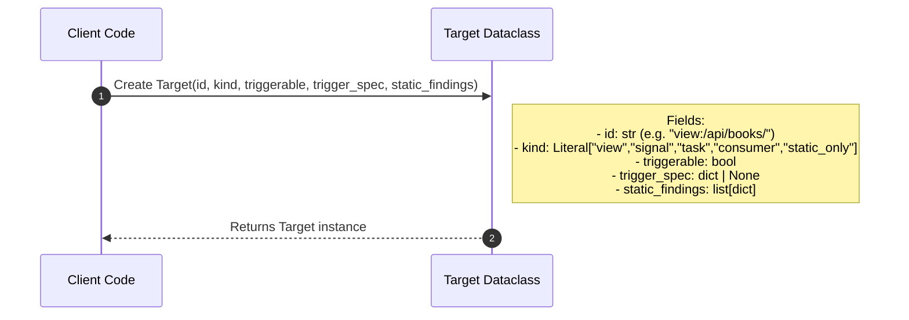

#### 5.1.2 `dqs.core.analyzer.AST Analyzer`

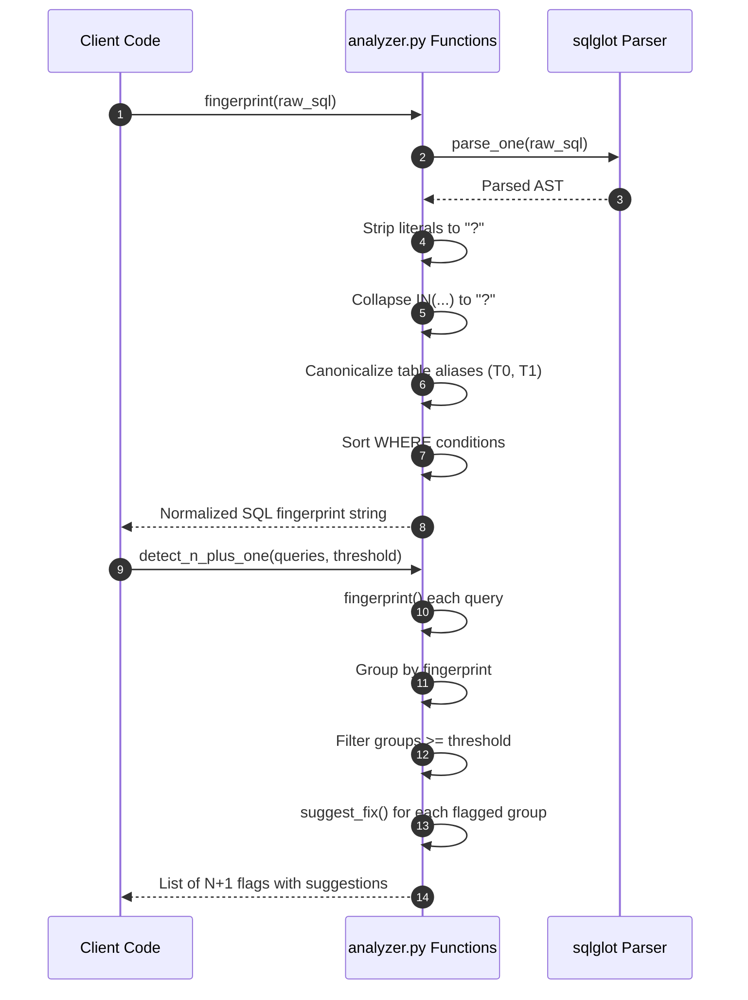

#### 5.1.3 `dqs.core.static_advisor.StaticASTAdvisor`

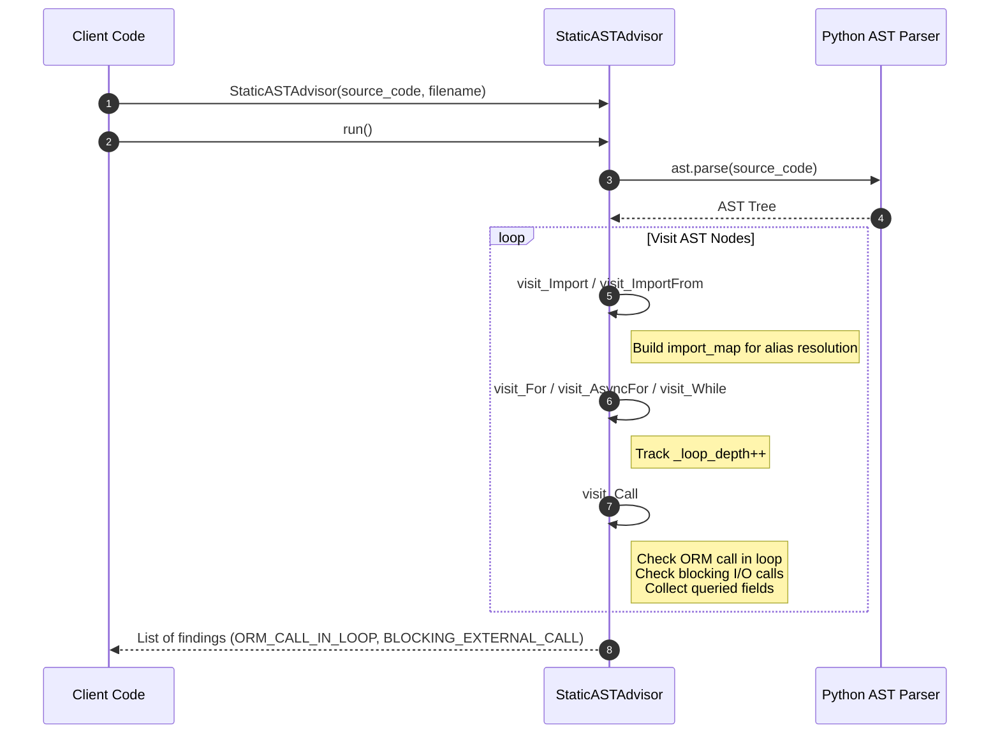

---

### 5.2 Django Adapter Classes

#### 5.2.1 `dqs.adapters.drf.routing.introspector.DjangoIntrospector`

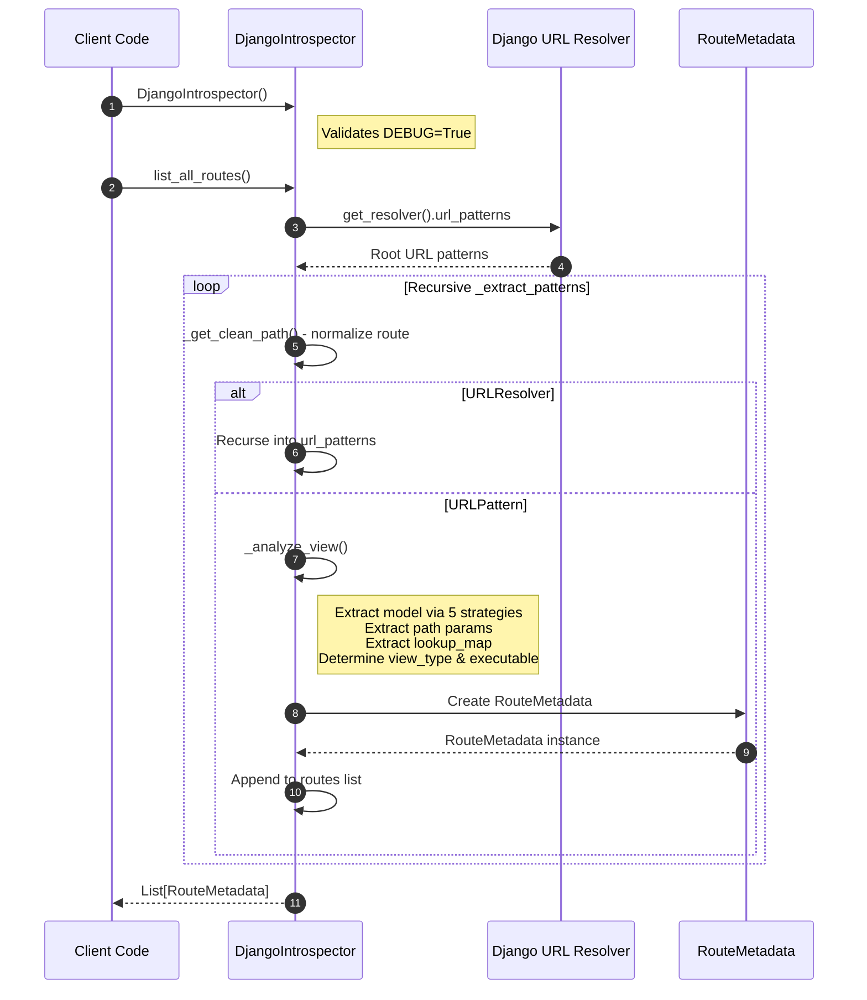

#### 5.2.2 `dqs.adapters.drf.routing.converters.PathConverterResolver`

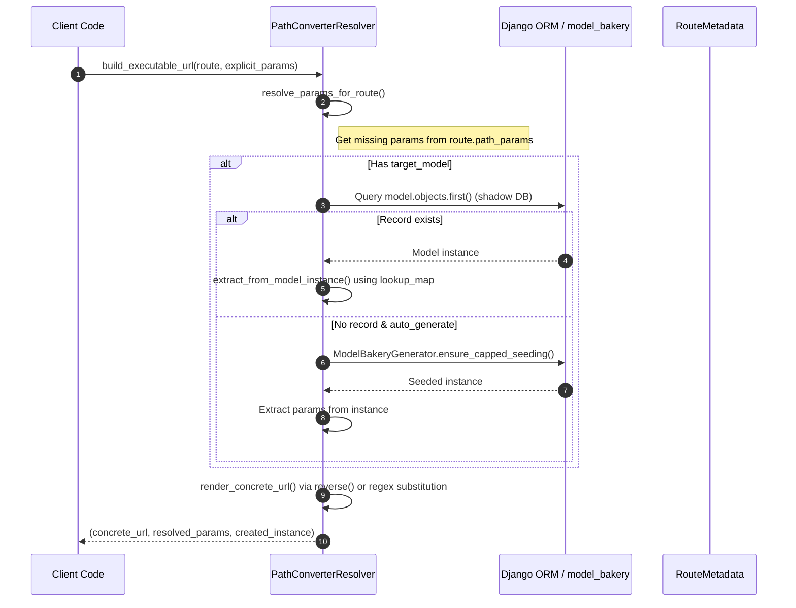

#### 5.2.3 `dqs.adapters.drf.mocking.generator.ModelBakeryGenerator`

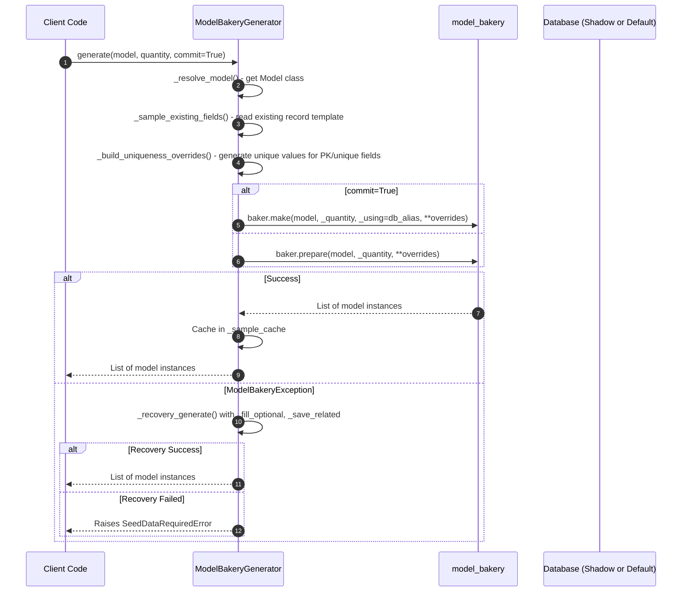

#### 5.2.4 `dqs.adapters.drf.execution.query_interceptor.QueryInterceptor`

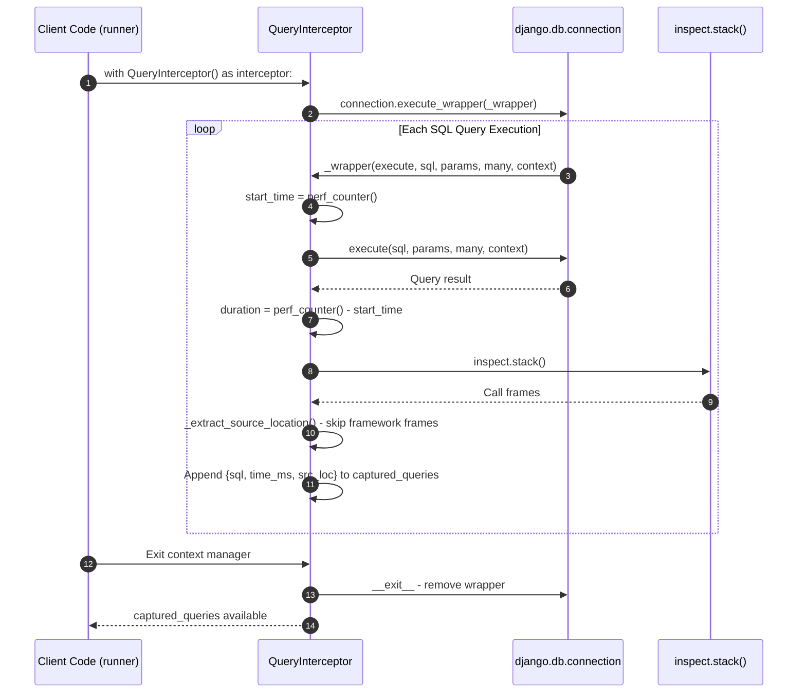

#### 5.2.5 `dqs.adapters.drf.execution.query_interceptor.QueryAnalysisEngine`

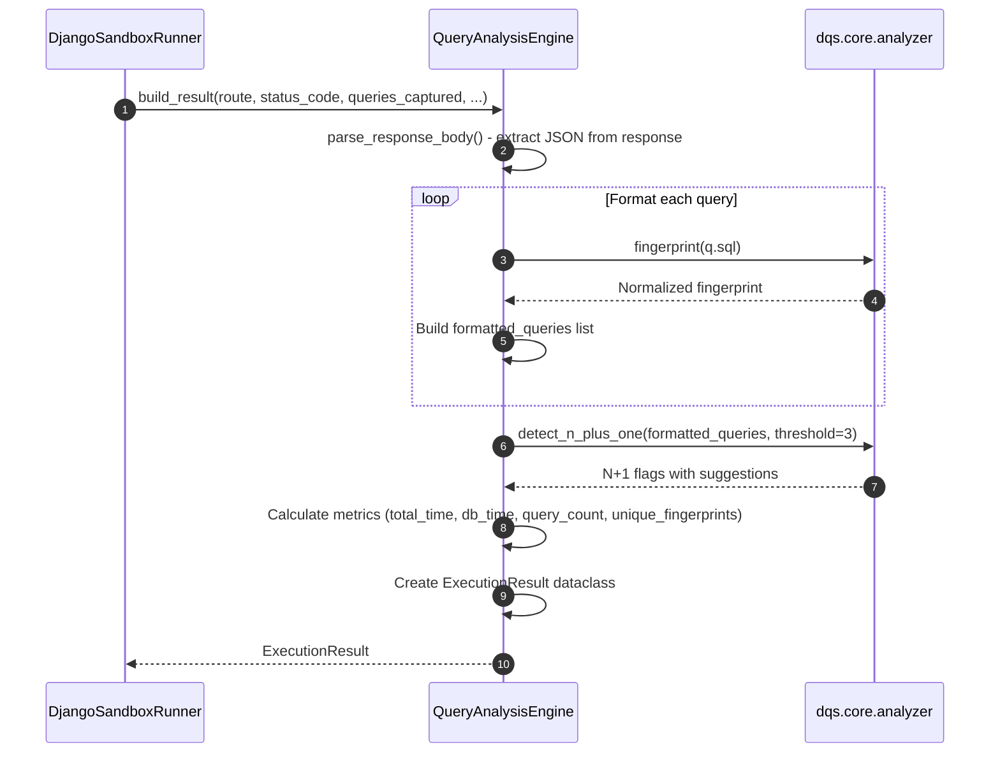

#### 5.2.6 `dqs.adapters.drf.execution.runner.DjangoSandboxRunner`

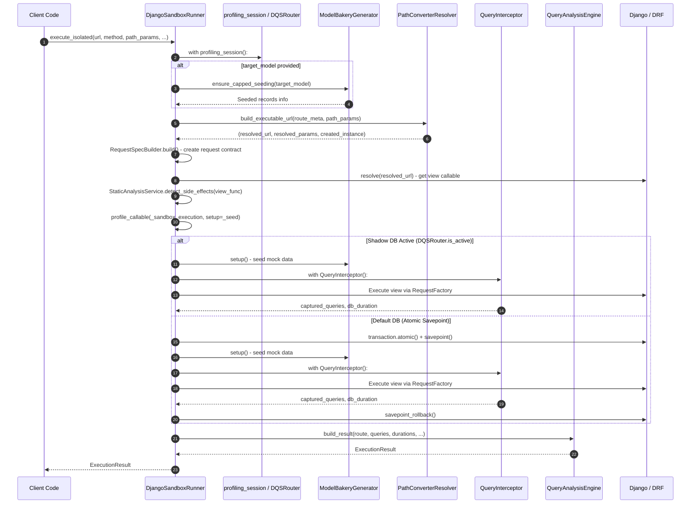

#### 5.2.7 `dqs.adapters.drf.execution.discovery.DjangoTargetDiscovery`

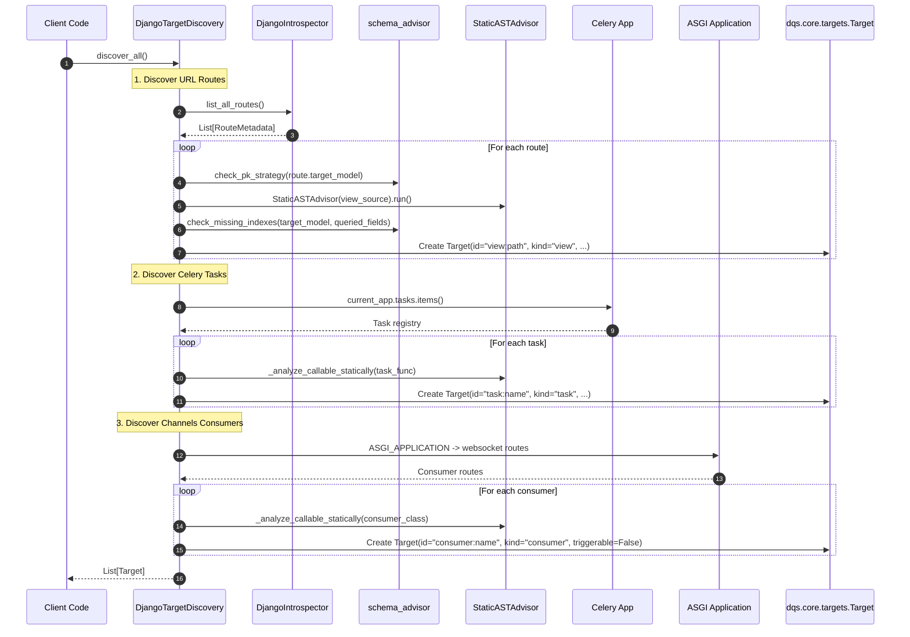

#### 5.2.8 `dqs.adapters.drf.router.DQSRouter` & `profiling_session`

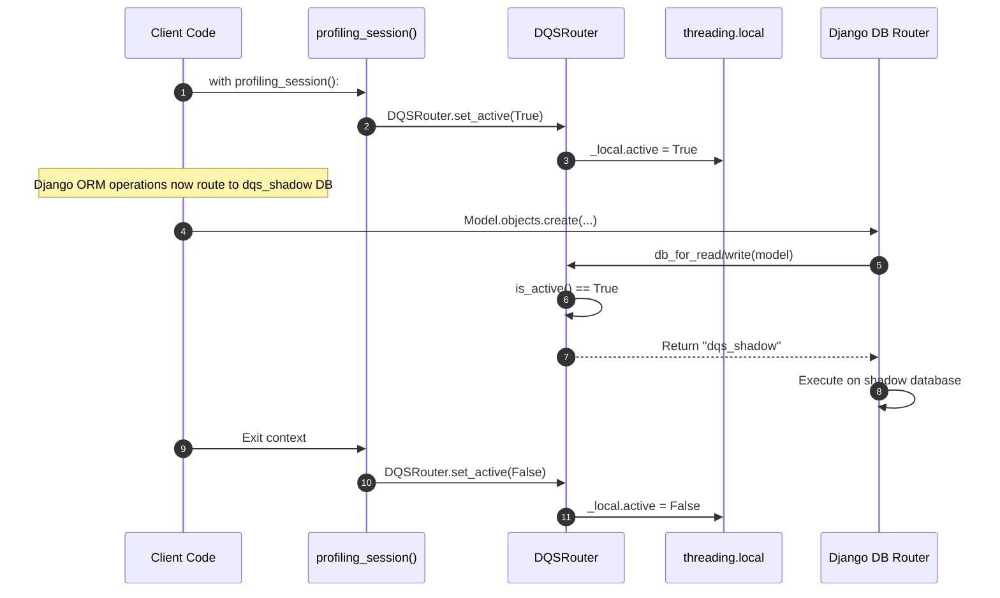

---

## 6. End-to-End Execution Sequence

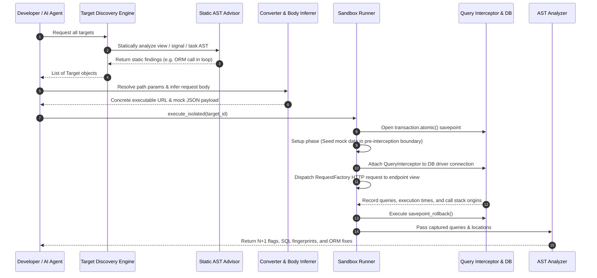

---

## 7. Security & Isolation Model

- **Safe Rollbacks**: Every query execution occurs strictly inside an atomic savepoint. No writes persist to disk or database tables.
- **`DEBUG=True` Guardrail**: Enforces that profiling runs only in development environments.
- **Sanitized SQL**: AST fingerprinting strips user data/literals before rendering analysis reports.
- **Shadow Database**: Optional isolated database (`dqs_shadow`) for profiling to keep development database clean.

---

## 8. Installation & Testing

### Development Installation

```bash
# From source (editable install)
pip install -e "C:\Users\mprof\OneDrive\Desktop\da-profiler"

# Or build and install
pip install dist/da_profiler-0.3.0-py3-none-any.whl
```

### Demo Project Setup

```bash
# 1. Go to demo project
cd demos/drf

# 2. Install dependencies
pip install -e "..[django]"

# 3. Configure settings (DEBUG=True, dqs_shadow DB, DATABASE_ROUTERS)

# 4. Run migrations on shadow DB
python manage.py migrate --database=dqs_shadow

# 5. Run tests
pytest -m core        # Pure Python tests (fast, no DB)
pytest -m django      # Django/DRF adapter tests (requires DB)
pytest                # All tests
```

### Using in Your Own Project

```bash
# Install from PyPI
pip install da-profiler[django]

# Add to settings.py (development only)
if DEBUG:
    INSTALLED_APPS += ["dqs.adapters.drf"]
    DATABASE_ROUTERS = ["dqs.adapters.drf.router.DQSRouter"]

# Configure shadow database
DATABASES = {
    "default": {...},
    "dqs_shadow": {...},  # Same engine as default
}

# Run shadow migrations
python manage.py migrate --database=dqs_shadow
```

---

## 9. Key Data Flow Summary

| Stage | Input | Component | Output |
|-------|-------|-----------|--------|
| **Discovery** | Django URL patterns | `DjangoIntrospector` | `List[RouteMetadata]` |
| **Target Creation** | Routes + AST analysis | `DjangoTargetDiscovery` | `List[Target]` |
| **Parameter Resolution** | Route + explicit params | `PathConverterResolver` | Concrete URL + params |
| **Mock Seeding** | Target model | `ModelBakeryGenerator` | DB records (shadow) |
| **Execution** | URL + method + params | `DjangoSandboxRunner` | HTTP response + queries |
| **Interception** | DB queries | `QueryInterceptor` | Queries with src_loc |
| **Analysis** | Captured queries | `QueryAnalysisEngine` + `analyzer.py` | N+1 flags + ORM fixes |
| **Result** | All above | `ExecutionResult` | Structured profiling report |

---

## 10. Complete Flow Diagrams

For detailed visual flow diagrams covering:
- Route discovery & dashboard loading
- Complete profiling execution (button click to results)
- Mock data seeding decision tree
- Query interception & N+1 detection
- High-level component interactions
- Simplified flow summary

See **[Flow Diagrams](./docs/flow-diagrams.md)**.