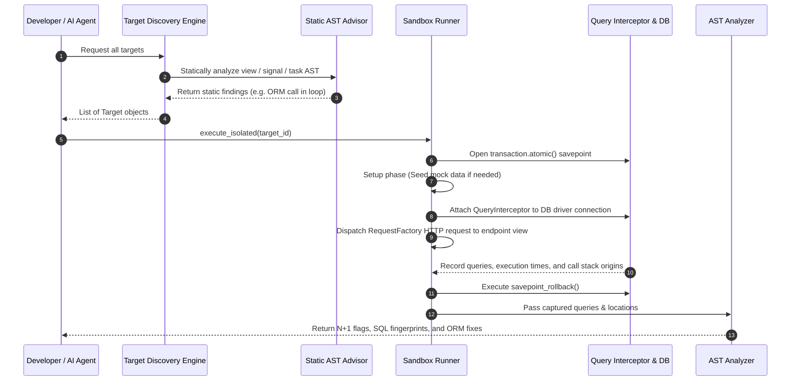

# Da Profiler — Architecture & System Design 🏗️

> **Da Profiler** (package `dqs`) is an isolated query profiling engine and static code advisor for Django applications. It automatically discovers endpoints, executes them safely inside self-rolling-back database savepoints, intercepts queries at the DB-driver boundary, normalizes SQL queries using AST fingerprinting to detect N+1 bottlenecks, and performs static code analysis on user code.

---

## 1. Core Architectural Principles

Da Profiler is built around three fundamental design principles:

1. **Framework-Agnostic Core (`dqs/core/`)**:
   - The core engine contains **zero Django or framework-specific imports**.
   - Handles SQL AST fingerprinting (`sqlglot`), N+1 aggregation algorithms, target abstractions (`Target`), and framework-independent static AST code scanning (`StaticASTAdvisor`).
2. **Framework Adapters (`dqs/adapters/`)**:
   - Framework-specific integration logic lives strictly inside adapters (e.g. `dqs/adapters/drf/`).
   - Adapters handle route discovery, ORM query interception, dynamic parameter resolution, and safe isolated execution.
3. **Zero Database Risk (Isolated Savepoints)**:
   - Profiled endpoints run strictly within `transaction.atomic()` savepoints.
   - All state changes (create, update, delete) are automatically rolled back when profiling finishes. The real database is never modified.

---

## 2. System Component Overview

```
                      +---------------------------------------+
                      |         Developer / AI Agent          |
                      +-------------------+-------------------+
                                          |
                                          v
+-----------------------------------------------------------------------------------+
|                            Da Profiler Core (dqs/core/)                           |
|                                                                                   |
|  +---------------------+   +--------------------------+   +--------------------+  |
|  |     Target Model    |   |     Static AST Advisor   |   |   AST Analyzer     |  |
|  |     (targets.py)    |   |   (static_advisor.py)    |   |   (analyzer.py)    |  |
|  +----------+----------+   +------------+-------------+   +---------+----------+  |
+-------------|---------------------------|---------------------------|-------------+
              |                           |                           |
              v                           v                           v
+-----------------------------------------------------------------------------------+
|                           Django Adapter (dqs/adapters/drf/)                      |
|                                                                                   |
|  +--------------------+    +---------------------------+    +------------------+  |
|  |  Target Discovery  |    |    DB Query Interceptor   |    | Sandbox Runner   |  |
|  |   (discovery.py)   |    |   (query_interceptor.py)  |    |   (runner.py)    |  |
|  +--------------------+    +---------------------------+    +------------------+  |
+-----------------------------------------------------------------------------------+
```

---

## 3. High-Level Component Breakdown

### A. Core Engine (`dqs/core/`)

#### 1. `analyzer.py` (AST SQL Analyzer & N+1 Detector)
- **`fingerprint(sql)`**: Leverages `sqlglot` to parse raw SQL queries into ASTs. It strips dynamic literals (e.g. IDs, strings), normalizes dynamic `IN (...)` parameter lists, and canonicalizes table aliases (`T0`, `T1`).
- **`detect_n_plus_one(queries, threshold)`**: Groups queries by a composite key of `(SQL Fingerprint, source_location)` and flags N+1 patterns that exceed the threshold.
- **`suggest_fix(fingerprint, relationships)`**: Generates copy-pasteable Django ORM fixes (such as `.select_related()` or `.prefetch_related()`).

#### 2. `targets.py` (Unified Target Dataclass)
- Defines the `Target` dataclass (`id`, `kind`, `triggerable`, `trigger_spec`, `static_findings`).
- Provides a unified shape for HTTP views, signals, Celery tasks, and background functions.

#### 3. `static_advisor.py` (Framework-Agnostic AST Advisor)
- Scans user python code statically without importing or executing it.
- **ORM Call in Loop**: Detects `.filter()`, `.get()`, `.all()` calls inside `for` loops.
- **Blocking Calls**: Detects synchronous I/O (`requests.get`, `smtplib.SMTP`, `time.sleep`) and resolves `import X as Y` and `from X import Y` aliases.

---

### B. Django Adapter (`dqs/adapters/drf/`)

#### 1. `discovery.py` (Target Discovery Engine)
- Discovers URL endpoints (`DjangoIntrospector`), Django signals (`post_save`, `pre_save`, `post_delete`), and Celery tasks.
- Populates `Target` instances and passes callables through `StaticASTAdvisor`.

#### 2. `introspector.py` (Route & URL Introspector)
- Recursively walks Django's `urlpatterns` tree.
- Categorizes views into DRF `ViewSet`, `APIView`, or standard Django function/class-based views.
- Safely reports `executable=False` when routes cannot be resolved statically.

#### 3. `query_interceptor.py` (DB-Driver Boundary Interceptor)
- Context manager hooking into Django's `connection.execute_wrapper()`.
- Captures SQL, execution duration, and walks `inspect.stack()` to attribute each query to exact user code line numbers.

#### 4. `runner.py` (Sandbox Execution Engine)
- **`profile_callable()`**: Runs callables inside a `transaction.atomic()` savepoint with the `QueryInterceptor` active. Ensures mock data seeding happens in a pre-profiling setup phase so seeding queries do not pollute query counts.
- **`execute_isolated()`**: Simulates HTTP requests via `RequestFactory` and rolls back all database mutations.

---

## 4. End-to-End Execution Sequence



---

## 5. Security & Isolation Model

- **Safe Rollbacks**: Every query execution occurs strictly inside an atomic savepoint. No writes persist to disk or database tables.
- **`DEBUG=True` Guardrail**: Enforces that profiling runs only in development environments.
- **Sanitized SQL**: AST fingerprinting strips user data/literals before rendering analysis reports.

---

## 6. Directory Structure Overview

```
dqs/
├── __init__.py
├── core/                       # Framework-agnostic engine (Zero Django imports)
│   ├── analyzer.py             # sqlglot-based SQL AST fingerprinting & N+1 detection
│   ├── static_advisor.py       # Pure AST static code advisor (loops, blocking I/O)
│   └── targets.py              # Unified Target dataclass
└── adapters/
    └── drf/                    # Django & DRF adapter
        ├── apps.py             # DQS Django AppConfig
        ├── discovery.py        # Views, signals, and tasks discovery
        ├── introspector.py     # URL route pattern tree walker
        ├── query_interceptor.py# DB connection.execute_wrapper hook
        ├── runner.py           # Savepoint execution & callable profiling
        └── schema_advisor.py   # Database schema recommendations
```
