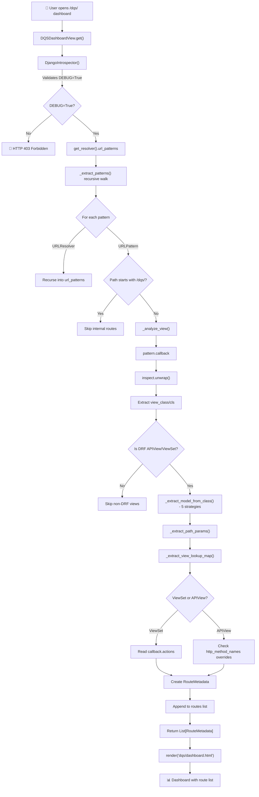
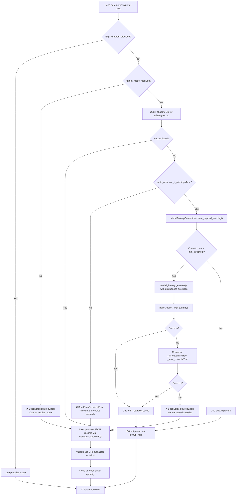
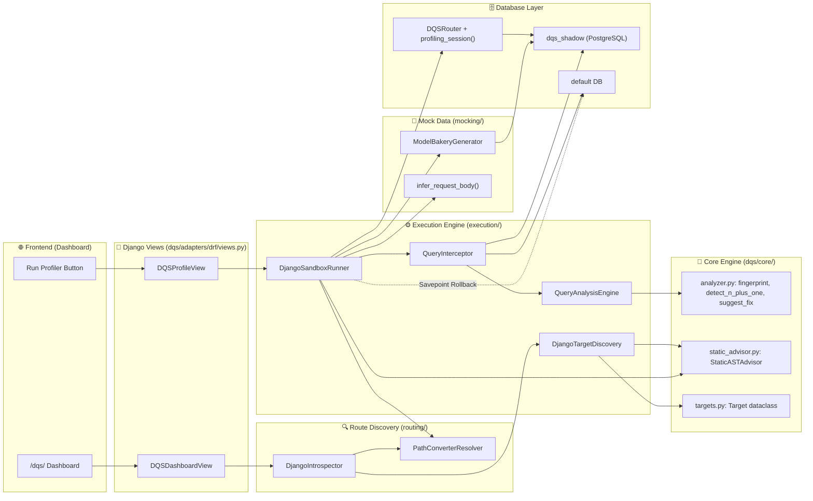
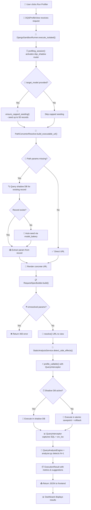

# Da Profiler — Complete Execution Flow Diagrams

This document provides comprehensive flow diagrams showing how Da Profiler works end-to-end, from route discovery to profiling execution with automatic mock data seeding.

---

## 1. Route Discovery & Dashboard Loading Flow



---

## 2. Complete Profiling Execution Flow (When "Run Profiler" is Clicked)

```mermaid
flowchart TD
    %% Entry Point
    Click["🖱️ User clicks 'Run Profiler' on /dqs/"] --> AJAXPost["POST /dqs/profile/ with JSON body"]
    AJAXPost --> ProfileView["DQSProfileView.post()"]
    ProfileView --> ValidateDebug{"DEBUG=True?"}
    ValidateDebug -->|No| Forbidden403["🚫 HTTP 403"]
    ValidateDebug -->|Yes| ParseBody["json.loads(request.body)"]
    ParseBody --> ExtractParams["Extract: route, method, path_params, seed_count, target_model"]
    
    %% Initialize Runner
    ExtractParams --> InitRunner["DjangoSandboxRunner()"]
    InitRunner --> ShadowDBMgr["ShadowDatabaseManager.ensure_initialized()"]
    ShadowDBMgr --> ValidateConfig["validate_configuration()"]
    ValidateConfig --> CheckShadowDB{"dqs_shadow in DATABASES?"}
    CheckShadowDB -->|No| ConfigError["❌ ImproperlyConfigured"]
    CheckShadowDB -->|Yes| CheckRouter{"DQSRouter in DATABASE_ROUTERS?"}
    CheckRouter -->|No| RouterError["❌ ImproperlyConfigured"]
    CheckRouter -->|Yes| RunMigrations["call_command migrate --database=dqs_shadow"]
    RunMigrations --> CreateFactory["APIRequestFactory()"]
    CreateFactory --> RunnerReady["Runner initialized"]
    
    %% Execute Isolated
    RunnerReady --> ExecuteIsolated["runner.execute_isolated()"]
    ExecuteIsolated --> ProfilingSession["with profiling_session():"]
    
    %% Shadow DB Activation
    ProfilingSession --> ActivateRouter["DQSRouter.set_active(True)"]
    ActivateRouter --> ThreadLocal["threading.local.active = True"]
    
    %% Step 1: Ensure Minimum Seeding (Capped Seeding)
    ThreadLocal --> CheckTargetModel{"target_model provided?"}
    CheckTargetModel -->|Yes| CappedSeeding["ModelBakeryGenerator.ensure_capped_seeding()"]
    CheckTargetModel -->|No| SkipCappedSeeding["Skip capped seeding"]
    
    CappedSeeding --> CountCheck["Count records in shadow DB"]
    CountCheck --> BelowThreshold{"count < SEED_MIN_THRESHOLD (1)?"}
    BelowThreshold -->|Yes| SeedUpToCap["Seed up to SEED_MAX_CAP (50) records"]
    BelowThreshold -->|No| SkipSeeding["Already enough records"]
    SeedUpToCap --> GenerateMocks["ModelBakeryGenerator.generate()"]
    SkipSeeding --> GenerateMocks
    GenerateMocks --> SeededRecords["Return seeded records info"]
    
    %% Step 2: Resolve Path Parameters
    SeededRecords --> BuildRouteMeta["Build RouteMetadata from route"]
    BuildRouteMeta --> ResolveParams["PathConverterResolver.build_executable_url()"]
    
    ResolveParams --> ExtractMissingParams["Find missing path_params"]
    ExtractMissingParams --> HasParams{"Has path params?"}
    HasParams -->|No| DirectURL["Use route path directly"]
    HasParams -->|Yes| ResolveEachParam["For each missing param:"]
    
    ResolveEachParam --> CheckModel{"target_model valid?"}
    CheckModel -->|No| ParamError["❌ SeedDataRequiredError"]
    CheckModel -->|Yes| QueryShadowDB["model.objects.using('dqs_shadow').first()"]
    QueryShadowDB --> FoundRecord{"Record exists?"}
    FoundRecord -->|Yes| ExtractValue["extract_from_model_instance() with lookup_map"]
    FoundRecord -->|No| AutoGenerate{"auto_generate_if_missing?"}
    AutoGenerate -->|No| ParamError
    AutoGenerate -->|Yes| SeedFallback["ModelBakeryGenerator.ensure_capped_seeding()"]
    SeedFallback --> NewRecord["Get newly seeded record"]
    NewRecord --> ExtractValue
    
    ExtractValue --> AllResolved{"All params resolved?"}
    AllResolved -->|No| ParamError
    AllResolved -->|Yes| RenderURL["render_concrete_url() via reverse() or regex"]
    RenderURL --> ConcreteURL["✅ Concrete executable URL"]
    
    %% Step 3: Build Request Spec
    ConcreteURL --> BuildSpec["RequestSpecBuilder.build()"]
    BuildSpec --> CheckUnresolved{"Any UNRESOLVED params?"}
    CheckUnresolved -->|Yes| HandoverError["❌ Return 400 with unresolved params"]
    CheckUnresolved -->|No| ResolveMatch["resolve(concrete_url)"]
    
    %% Step 4: Side Effect Analysis
    ResolveMatch --> SideEffectCheck["StaticAnalysisService.detect_side_effects()"]
    SideEffectCheck --> GetSource["inspect.getsource(view_func)"]
    GetSource --> RunASTAdvisor["StaticASTAdvisor(source).run()"]
    RunASTAdvisor --> CollectWarnings["Collect BLOCKING_EXTERNAL_CALL findings"]
    CollectWarnings --> SideEffectWarnings["side_effect_warnings list"]
    
    %% Step 5: Execute in Sandbox
    SideEffectWarnings --> ProfileCallable["profile_callable(_sandbox_execution, setup=_seed)"]
    
    ProfileCallable --> RouterCheck{"DQSRouter.is_active()?"}
    RouterCheck -->|Yes| ShadowMode["Shadow DB Mode"]
    RouterCheck -->|No| DefaultMode["Default DB + Savepoint Mode"]
    
    %% Shadow DB Mode
    ShadowMode --> SetupSeed["_seed() - seed additional if seed_count > 0"]
    SetupSeed --> WithInterceptor["with QueryInterceptor():"]
    WithInterceptor --> ExecView["Execute view via RequestFactory"]
    
    %% Default DB Mode
    DefaultMode --> Atomic["transaction.atomic()"]
    Atomic --> Savepoint["transaction.savepoint()"]
    Savepoint --> TryBlock["try:"]
    TryBlock --> SetupSeed2["_seed()"]
    SetupSeed2 --> WithInterceptor2["with QueryInterceptor():"]
    WithInterceptor2 --> ExecView2["Execute view via RequestFactory"]
    ExecView2 --> Finally["finally:"]
    Finally --> Rollback["transaction.savepoint_rollback(sid)"]
    
    %% Query Interception (Both Modes)
    ExecView --> InterceptQueries["QueryInterceptor captures:"]
    ExecView2 --> InterceptQueries
    InterceptQueries --> CaptureSQL["SQL + time_ms + src_loc (via inspect.stack)"]
    CaptureSQL --> ReturnQueries["Return captured_queries"]
    
    %% Step 6: Analyze & Build Result
    ReturnQueries --> QueryAnalysis["QueryAnalysisEngine.build_result()"]
    QueryAnalysis --> FormatQueries["Format each query with fingerprint()"]
    FormatQueries --> DetectNPlusOne["detect_n_plus_one(formatted_queries, threshold=3)"]
    DetectNPlusOne --> GroupByFP["Group by fingerprint + src_loc"]
    GroupByFP --> CheckThreshold{"count >= 3 & SELECT?"}
    CheckThreshold -->|Yes| SuggestFix["suggest_fix() with relationships"]
    CheckThreshold -->|No| NoFlag["No N+1 flag"]
    SuggestFix --> BuildAnalysis["Build analysis payload"]
    NoFlag --> BuildAnalysis
    BuildAnalysis --> CalcMetrics["Calculate: total_time, db_time, query_count, unique_fps"]
    CalcMetrics --> BuildResult["Create ExecutionResult dataclass"]
    
    %% Return Response
    BuildResult --> JSONResponse["JsonResponse with DQSJSONEncoder"]
    JSONResponse --> Frontend["📊 Frontend displays results"]
    
    %% Cleanup
    Frontend --> DeactivateRouter["DQSRouter.set_active(False)"]
    DeactivateRouter --> ThreadLocalClear["threading.local.active = False"]
    ThreadLocalClear --> Done["✅ Profiling complete"]
    
    %% Error Paths
    ConfigError --> JSONResponse
    RouterError --> JSONResponse
    ParamError --> JSONResponse
    HandoverError --> JSONResponse
```



---

## 3. Mock Data Seeding Decision Flow



---

## 4. Query Interception & N+1 Detection Flow

```mermaid
flowchart TD
    Execute["View executes ORM queries"] --> Wrapper["QueryInterceptor._wrapper() called"]
    Wrapper --> TimerStart["start = perf_counter()"]
    TimerStart --> ExecSQL["execute(sql, params, many, context)"]
    ExecSQL --> TimerEnd["duration = perf_counter() - start"]
    TimerEnd --> StackTrace["inspect.stack()"]
    StackTrace --> FilterFrames["Filter out: site-packages, django/, rest_framework/, dqs/"]
    FilterFrames --> FindUserFrame["Find first user code frame"]
    FindUserFrame --> FormatLoc["Format as 'path/file.py:lineno'"]
    FormatLoc --> Store["Append {sql, time_ms, src_loc} to captured_queries"]
    
    %% After execution
    Store --> Analysis["QueryAnalysisEngine.build_result()"]
    Analysis --> FingerprintAll["fingerprint() each query"]
    
    FingerprintAll --> ParseAST["sqlglot.parse_one(sql)"]
    ParseAST --> StripLiterals["Replace all Literals with '?'"]
    StripLiterals --> CollapseIn["Collapse IN (...) to IN (?)"]
    CollapseIn --> CanonicalizeAlias["Canonicalize table aliases to T0, T1..."]
    CanonicalizeAlias --> SortWhere["Sort AND conditions alphabetically"]
    SortWhere --> NormalizedFP["Normalized fingerprint string"]
    
    NormalizedFP --> GroupByFP["Group queries by (fingerprint, src_loc)"]
    GroupByFP --> CountGroups["Count queries per group"]
    CountGroups --> ThresholdCheck{"count >= threshold (3)?"}
    ThresholdCheck -->|Yes| FlagNPlusOne["Flag as N+1"]
    ThresholdCheck -->|No| NoFlag["Not an N+1 pattern"]
    
    FlagNPlusOne --> SuggestFix["suggest_fix(fingerprint, relationships)"]
    SuggestFix --> ParseFP["sqlglot.parse_one(fingerprint)"]
    ParseFP --> GetTable["Extract target table name"]
    GetTable --> CheckRelationships{"relationships mapping provided?"}
    CheckRelationships -->|Yes| LookupRel["Find field_name & rel_type"]
    CheckRelationships -->|No| GenericSuggest["Generic select_related/prefetch_related"]
    LookupRel --> SpecificSuggest[".select_related('field') or .prefetch_related('field')"]
    SpecificSuggest --> BuildPayload["Add to analysis payload"]
    GenericSuggest --> BuildPayload
    NoFlag --> BuildPayload
    
    BuildPayload --> FinalResult["ExecutionResult with analysis array"]
```



---

## 5. High-Level Component Interaction Flow



---

## 6. Simplified Flow Summary (For Quick Reference)



---

## Key Decision Points Summary

| Step | Decision | Yes Path | No Path |
|------|----------|----------|---------|
| 1 | DEBUG=True? | Continue | 403 Forbidden |
| 2 | dqs_shadow in DATABASES? | Continue | Config Error |
| 3 | DQSRouter in DATABASE_ROUTERS? | Continue | Config Error |
| 4 | target_model provided? | Capped seeding | Skip |
| 5 | Records < threshold? | Seed up to cap | Skip |
| 6 | Path params missing? | Resolve each | Direct URL |
| 7 | Record in shadow DB? | Extract param | Auto-seed if enabled |
| 8 | Auto-generate enabled? | model_bakery generate | SeedDataRequiredError |
| 9 | model_bakery primary success? | Use result | Recovery attempt |
| 10 | Recovery success? | Use result | SeedDataRequiredError |
| 11 | All params resolved? | Continue | Return 400 with unresolved |
| 12 | Shadow DB active? | Persist in shadow | Savepoint + rollback |
| 13 | Query count >= threshold? | Flag N+1 + suggest fix | No flag |

---

## Data Flow Summary

```
User Request
    │
    ▼
DQSProfileView (validates DEBUG, parses JSON)
    │
    ▼
DjangoSandboxRunner.execute_isolated()
    │
    ├──► profiling_session() ──► DQSRouter.set_active(True)
    │
    ├──► ModelBakeryGenerator.ensure_capped_seeding() ──► Shadow DB
    │
    ├──► PathConverterResolver.build_executable_url()
    │       ├──► Query shadow DB for existing record
    │       └──► Fallback: model_bakery generate with recovery
    │
    ├──► RequestSpecBuilder.build() ──► Validate params
    │
    ├──► StaticAnalysisService.detect_side_effects() ──► AST scan
    │
    ├──► profile_callable()
    │       ├──► QueryInterceptor (captures SQL + stack trace)
    │       └──► Execute view via RequestFactory
    │
    ├──► QueryAnalysisEngine.build_result()
    │       ├──► analyzer.fingerprint() each query
    │       ├──► analyzer.detect_n_plus_one()
    │       └──► analyzer.suggest_fix()
    │
    ▼
ExecutionResult (dataclass) ──► JSON Response ──► Frontend Dashboard
```

---

*Generated from Da Profiler v0.3.0 source code analysis*